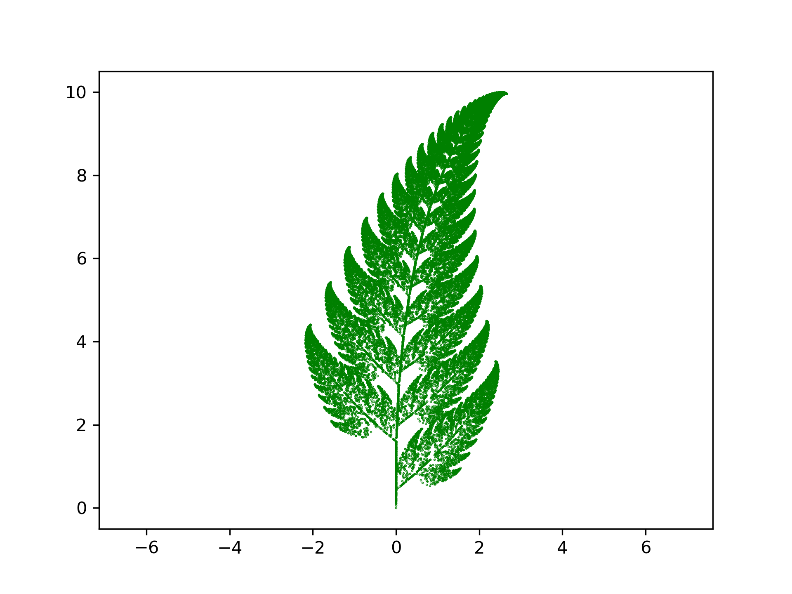

# Chaos game

Project in IN1910.
Creates fractals using a polygon and a random initial point.
<a href="https://en.wikipedia.org/wiki/Chaos_game">Read more</a>

<table style="width:100%">
  <tr>
    <th></th>
    <th></th>
  </tr>
  <tr>
    <td></td>
    <td></td>
  </tr>
  <tr>
    <td></td>
    <td></td>
  </tr>
</table>
